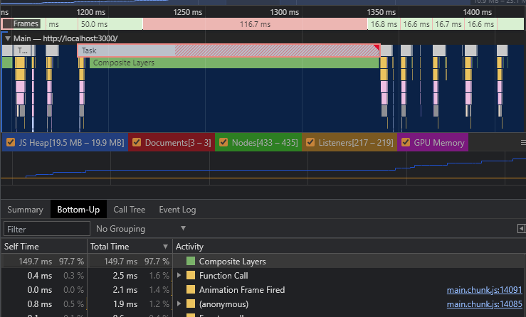
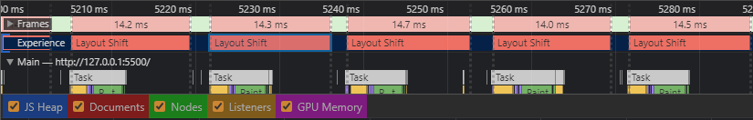
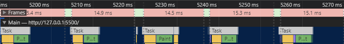
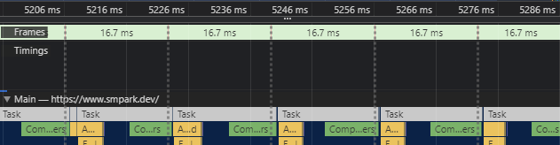
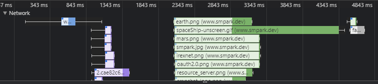
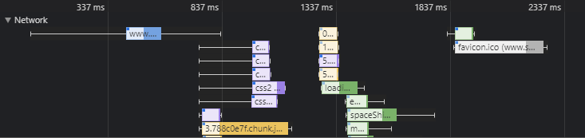

# SMP Portfolio & Youtube Summary Card Site

`Portfolio` & `Youtube Summary Card`는 ReactJS(Hook)를 이용하여 제작하였습니다. `Portfolio site`는 HTML과 VanillaJS로 제작하였던 프로젝트를 ReactJS로 변환하였고 `Youtube & Summary Card`는 ReactJS(Hook)로 추가 제작하였습니다.

<br>

## Projects Index Link

- [🚀 Portfolio Site](#Portfolio__Site)
- [📢 Youtube Channel](#Youtube__Channel)
- [📝 Summary Card](#Summary__Card)

<br>

## Version

`smpark.dev`_(v1.0.0)_

<br>

## IDE

    

- **Tool** - `VSCode`_(v1.57)_
- **Front End** - `ReactJS(Hook)`_(v17.0.2)_
- **Deploy** - `Netlify-cli`_(v3.37.37)_
- **Data Base** - `Firebase`_(v8.6.8)_
- **Image Storage** - `Cloudinary`_(v1.26.1)_

<br>

<br>

## Portfolio\_\_Site

저를 소개하기 위한 포트폴리오 페이지입니다.  
모든 기능은 직접 제작하였으며 우주 컨셉으로 디자인하였습니다.

#### Introduce

- **배경**  
  Interactive Developer 유튜브를 보고 감명을 받아, 처음으로 `Canvas`를 사용하여 배경 이미지를 만들어 보았습니다. 랜덤 값을 통해 별을 찍고 별똥별을 만들어 떨어트리는 기능을 제작하였습니다.  
  Build pattern을 사용하여 쉽게 별의 숫자와 크기, 별똥별의 크기 등을 조절하기 쉽게 하였습니다.

  ```javascript
  export default class StarryNight {
    draw(canvas) {
      new MilkyWayBuilder() //
        .starCount(5)
        .starSize(5)
        .build(canvas);

      new ShootingStarBuilder() //
        .starSize(8)
        .build(canvas);
    }
  }
  ```

- **메뉴**  
  현재 View의 위치에 따라 메뉴 이펙트가 변하고, 클릭을 통해 해당 섹션으로 이동하는 기능을 만들었습니다.  
  최초에는 스크롤 이벤트를 통해 처리했지만, 성능을 고려하여 `Interactive Observer API`를 사용하는 방식으로 바꾸었습니다.

  ```javascript
  _callback(onObserveTarget) {
    return (entries, observer) => {
      entries.forEach((entry) => {
        if (!entry.isIntersecting && entry.intersectionRatio > 0) {
          this._setElementByObserve(
            onObserveTarget,
            entry.target,
            entry.boundingClientRect.y
          );
        } else if (entry.isIntersecting && entry.intersectionRatio > 0) {
          this._setElementByObserve(onObserveTarget, entry.target);
        }
      });
    };
  }
  ```

- **가이드**  
  `Portfolio site`의 현재 View 위치를 간접적으로 알려주는 우주선 가이드 기능을 만들었습니다. 스크롤 이동을 통한 px의 비율을 가로축의 px로 변환하여 우주선을 이동시킵니다.

  ```javascript
  _render(element) {
    return (e) => {
      const rocket = element.childNodes[1];
      const currHeight = this.portfolio.scrollTop;
      const distance = getRocketMoveDistancePixel(element, this.portfolio);
      const rotate = getRocketRotate(this.prevHeight, currHeight);

      rocket.style.transform = `translateX(${distance}px) ${rotate}`;

      // 이전 높이 업데이트
      if (currHeight > 0) this.prevHeight = currHeight;
    };
  }
  ```

- **구현**  
  🚀[**smpark.dev**](https://smpark.dev)에서 확인하실 수 있습니다.

<br>

## Youtube\_\_Channel

개발자가 추천한 유튜브 리스트를 시청 및 저장하거나 직접 유튜브를 검색 및 저장 할 수 있는 사이트입니다.  
로그인을 통해서 이용할 수 있습니다.

#### Introduce

- **유튜브**  
  `Youtube API`에서 제공하는 영상 데이터를 통해 개발자가 추천한 영상 리스트를 볼 수 있고 직접 유튜브를 통해 검색 할 수 있는 기능입니다. 다만 유튜브 정책으로 그 횟수(Point)가 정해져 있으며 해당 횟수를 넘으면 이용할 수 없습니다.

  ```javascript
  async search(query, pageToken, maxResults = 25) {
    const data = {
      params: {
        part: 'snippet',
        q: query,
        maxResults,
        type: 'video',
      },
    };

    if (pageToken === 'none' || !pageToken) return;

    data.params.pageToken = pageToken;

    try {
      const response = await this.youtube.get('search', data);

      return response.data;
    } catch (error) {
      return error.response.data;
    }
  }
  ```

- **리스트**  
  리스트는 `Search`, `My List`, `Smpark's Picks`, `ETC`로 이루어져 있습니다.  
  불러오는 데이터의 수를 25개로 고정하여 일정한 로딩 시간을 유지합니다.  
  `SMPChat`에서 마우스 이벤트와 디바운스로 `List Load` 기능을 구현했다면, 해당 프로젝트에서는 `Interactive Observer API`로 구현하였습니다.  
  웹 스토리지를 통해 현재 바라보고 있는 리스트를 저장하여 보여줌으로써 유튜브에서 제공하는 API Point를 절약합니다.  
  유저의 액션에 따라 리스트가 활성화되어 해당 리스트를 보여줍니다.

  ```javascript
  _callback() {
    return (entries, observer) => {
      entries.forEach((entry) => {
        if (entry.isIntersecting) {
          if (this.id === 'smpark') {
            loadNextSmparkList(
              this.youtube,
              this.token,
              this.onYoutubeLayerSet
            );
          } else if (this.id === 'search') {
            loadNextSearchList(
              this.youtube,
              this.token,
              this.onYoutubeLayerSet,
              this.query
            );
          }

          observer.disconnect();
        }
      });
    };
  }

  ```

- **로그인**  
  Youtube와 Summary Card 기능은 로그인 후 이용이 가능합니다.
  로그인은 `Firebase`를 이용하여 처리합니다.  
  `Google`, `Github`를 통한 로그인과 자체 제작한 `SMP Oauth Server`를 이용한 로그인이 가능합니다.  
  특히 `SMP Oauth Login`은 Oauth 2.0으로 받아온 유저 정보를 `Firebase`에서 지정한 방식으로 토큰화하여 넘겨줌으로써 연동되며, 로그인 및 로그아웃, 계정 관리 등 `Firebase Console`에서 다른 로그인 방식과 마찬가지로 일괄적으로 처리 및 관리가 가능합니다.

  ```javascript
  const userData = resourceRes.data.userData;

  const loginToken = jwt.sign(
    {
      iss: process.env.REACT_APP_FIREBASE_JWT_ACOUNT_EMAIL,
      sub: process.env.REACT_APP_FIREBASE_JWT_ACOUNT_EMAIL,
      aud: 'https://identitytoolkit.googleapis.com/google.identity.identitytoolkit.v1.IdentityToolkit',
      iat: Math.floor(Date.now() / 1000),
      exp: Math.floor(Date.now() / 1000) + 60 * 60,
      uid: userData.username,
    },
    process.env.REACT_APP_FIREBASE_JWT_SECRET_KEY,
    { algorithm: 'RS256' }
  );

  userData.token = loginToken;

  return userData;
  ```

- **구현**  
  🚀[**smpark.dev/study**](https://smpark.dev/study)에서 확인하실 수 있습니다.
  <br>

## Summary\_\_Card

최근 유튜브를 통해 많고 다양한 양질의 정보를 얻을 수 있기 때문에 이를 이용하여 스터디 할 수 있는 페이지를 만들었습니다.  
`My List`에 저장한 유튜브 영상을 클릭 후 카드 작성을 통해 이용할 수 있으며, 영상의 정보를 이용자가 간략하게 정리하고 볼 수 있는 기능입니다.  
`TOAST UI Editor`를 사용하여 작성 시의 편의성을 높였습니다. 이미지는 `Cloudinary`에 저장되며 카드 내용은 `Firebase`를 통해 실시간 저장됩니다.

#### Introduce

- **이미지 업로드**  
  그동안은 SSR 방식의 개발로 이미지 파일은 BE를 통해 서버 폴더에 저장했습니다.  
  이번 CSR 방식 개발에서는 `Cloudinary`를 이용하여 저장하였습니다.

  ```javascript
  async imageUpload(file) {
    const data = new FormData();

    data.append('file', file);
    data.append(
      'upload_preset',
      `${process.env.REACT_APP_CLOUDINARY_CLOUD_UNSIGNED_NAME}`
    );

    try {
      const response = await this.cloudinary.post('upload', data);

      return response.data;
    } catch (error) {
      return error.response.data;
    }
  }
  ```

<br>

- **실시간 저장**  
  요약 카드는 `Firebase`의 `Realtime Database` 기능을 통해 실시간으로 내용이 저장되어 작성 중인 데이터가 훼손되지 않도록 하였습니다.

  ```javascript
  saveCard(userId, videoId, card) {
    firebaseDatabase
      .ref(`${userId}/summaryCard/${videoId}/${card.id}`)
      .set(card);
  }

  deleteCard(userId, videoId, card) {
    firebaseDatabase
      .ref(`${userId}/summaryCard/${videoId}/${card.id}`)
      .remove();
  }

  readCard(userId, videoId, cb) {
    firebaseDatabase
      .ref(`${userId}/summaryCard/${videoId}`)
      .on('value', (snapshot) => {
        cb(snapshot.val());
      });
  }

  readCardList(userId, cb) {
    firebaseDatabase
      .ref(`${userId}/summaryCard/`)
      .on('value', (snapshot) => cb(snapshot.val()));
  }
  ```

<br>

- **편의 기능**  
  요약 카드가 작성된 목록의 데이터를 구별하기 위해서 `Bookmark` 기능을 만들었습니다. 작성 시 자동으로 생성되며 색상을 선택할 수 있습니다.  
  또한, 카드를 작성하는 유저에게 편의성을 제공하기 위하여 `TOAST UI Editor`를 추가하였고 `TOAST`에서 제공하는 `color-pick`, `table-merge` 등을 추가로 적용하였습니다.

  ```javascript
  import { Editor } from '@toast-ui/react-editor';
  import colorSyntax from '@toast-ui/editor-plugin-color-syntax';
  import tableMergedCell from '@toast-ui/editor-plugin-table-merged-cell';
  ```

  ```html
  <div className="{styles.editor}">
    <Editor
      className="{styles.toastEditor}"
      previewStyle="tab"
      height="250px"
      previewHighlight="{false}"
      initialEditType="wysiwyg"
      useCommandShortcut="{true}"
      usageStatistics="{false}"
      hideModeSwitch="{true}"
      plugins="{[colorSyntax,"
      tableMergedCell]}
      ref="{editorRef}"
      onChange="{onContentsChange}"
    />
  </div>
  ```

- **구현**  
  🚀[**smpark.dev/study**](https://smpark.dev/study)에서 `요약 카드`를 클릭 시 확인하실 수 있습니다.

<br>

## Common

- **Optimization**

  - **memo**  
    리액트는 props, state 또는 부모 컴포넌트가 변경되면 Render됩니다.  
    하지만 값이 변경되지 않아 굳이 Render되지 않아도 되는 컴포넌트는 memo를 통해 캐시하여 Render를 방지하였습니다.  
    또한 상위 부모 단계 컴포넌트 중 업데이트가 빈번하게 일어나는 경우엔 memo를 사용하면 의미없이 캐시가 반복되기 때문에 사용하지 않았습니다.

    ```javascript
    import React, { memo } from 'react';

    const Card = memo(({ ... }) => { ... })
    ```

     <br>

  - **useState**  
     setState를 호출하면 state를 비교 후 업데이트가 필요한 경우 Render하는데 Object의 경우 값을 변경하여도 레퍼런스는 변경되지 않으므로 Spread Operator를 통해 새로운 Object를 만들어서 리턴하였습니다.  
     또한 useState는 비동기이므로 setState를 콜백 후 업데이트하여 Object를 최신화 하였습니다.

    ```javascript
    import React, { useState } from 'react';

    const [layer, setLayer] = useState([...]);

    setLayer((list) => {
      return list.map((item) => {
        if (item.id === currView) {
          return { ...item, view: 'on' };
        }
        return { ...item, view: 'off' };
      });
    });
    ```

     <br>

  - **useCallback**  
    리액트 Hook의 콜백함수는 Render가 일어날 때마다 새로 만들어지게 됩니다.  
    컴포넌트가 변경이 되어도 한번 만들어진 함수를 재사용하기 위하여 useCallback을 사용하였습니다.  
    콜백함수 안에서 사용하는 데이터의 변경이 있을 때만 새로 만들어지도록 Dependency List에 데이터를 넣어 명시하였습니다.

    ```javascript
    import React, { useCallback } from 'react';

    const onUpdateCard = useCallback(
      (card) => {
        cardRepo.saveCard(auth, videoId, card);
      },
      [auth, cardRepo, videoId]
    );
    ```

     <br>

  - **useMemo**  
    하나의 컴포넌트에서 복수의 state가 변경된다면 변경시마다 Render가 일어나게 되며 메모리제이션되지 않은 데이터는 재호출되게 됩니다.  
    데이터가 바뀌지 않는다면 Render가 반복되더라도 한번만 호출되도록 useMemo를 적용하였습니다.

    ```javascript
    import React, { useMemo } from 'react';

    const auth = useMemo(() => localStorage.getItem('state'), []);
    ```

    <br>

- **Performance**

  - **Document Structure**  
    Data의 구조를 Array에서 Object로 변경하였습니다.

    `before`

    ```javascript
    // Data 구조 -> array
    const data = [
      {id: '1', ...},
      {id: '2', ...}
    ];

    // Data Read
    {data.map((item) => (
      <component
        key={item.id}
        item={item}
        ...
      />
    ))}
    ```

    위와 같은 구조는 데이터의 양이 많거나 최악의 경우 원하는 아이템의 위치가 배열의 끝의 위치하게 되면 모든 데이터를 탐색해야 하므로 일정한 성능을 유지할 수 없습니다.  
     ex) O(n)

    `after`

    ```javascript
    // Data 구조 -> object
    const data = {
      `1`: {id: '1', ...},
      `2`: {id: '2', ...}
    };

    // Data Read
    {Object.keys(data).map((key) => (
      <component
        key={key}
        item={data[key]}
        ...
      />
    ))}
    ```

    오브젝트의 키로 접근할 수 있게 수정하면 모든 아이템을 탐색할 필요 없이 key로 바로 접근이 가능하기 때문에 데이터가 쌓일 수록 `before`보다 빠르고 일정한 속도를 유지할 수 있습니다.  
    ex) O(1)

    <br>

  - **Rendering**  
    렌더링 과정에서 발생하는 이슈들을 개선하여 렌더링 속도를 향상시켰습니다.

    1.  `Composite Layers`  
        Portfolio page의 skills 섹션에서 work 섹션으로 스크롤 중 프레임이 드롭되는 이슈가 있어 이를 해결하였습니다.

        - 원인  
          렌더링의 속도를 높이기위해서는 dom요소가 작을수록 유리한데, work 섹션의 이미지 용량만 압축하고 사이즈를 자르지 않아 해당 섹션에 진입시 프레임 드롭 문제 발생

          `Frame Drop`
          

        - 해결  
          3780 x 3163 크기의 이미지를 200 x 171 크기로 변경

          <br>

    2.  `Layout Shift`  
        Portfolio page에서 스크롤링 시 Layout Shift가 일어나는 이슈가 있어 이를 해결하였습니다.

        - 원인  
          로켓 가이드 기능 중 로켓의 위치 값 CSS를 top & left 속성으로 이동시키고 있었기에 Layout Shift가 일어나 dom 요소의 위치와 크기가 스크롤시마다 재 설정되는 문제 발생

          `Layout Shift - before`
          

        - 해결  
          로켓의 위치를 top & left 속성이 아닌 translate 속성을 통해 변경

          참고 사이트 : [📃[CSS Triggers]](https://csstriggers.com/)

          ```javascript
          rocket.style.transform = `translateX(${distance}px) ${rotate}`;
          ```

          `Layout Shift - after`
          

          <br>

    3.  `Frame Drop`  
        Portfolio page 이탈 후 복귀 시 프레임이 드랍되는 이슈

        - 원인  
          Canvas에서 사용한 requestAnimationFrame을 페이지를 벗어날 시 멈추지 않았기에 문제 발생

          `Frame - before`
          

        - 해결  
          해당 페이지 이탈 시 milky_way.js와 shooting_star.js에 cancelAnimationFrame를 적용

          ```javascript
          useEffect(() => {
            const canvas = canvasRef.current;

            starryNight.draw(canvas);

            return () => {
              starryNight.clear(canvas);
            };
          }, [starryNight]);
          ```

          ```javascript
          if (this.clear === 'clear') cancelAnimationFrame(raf);
          ```

          `Frame - after`
          

    <br>

  - **Code Splitting**

    해당 리액트 포트폴리오를 프로젝트 별로 코드 스플리팅하여 로딩 시간을 개선하였습니다.

    - 원인  
      빌드 시 프로젝트의 코드가 main.js에 집중되어 초기 로딩시간이 증가하는 이슈 발생

      `loading time - before`
      

    - 해결  
      컴포넌트 비동기 로딩을 위한 lazy 사용과 이를 발동시키고 로딩 중 UI를 보여주는 Suspense를 사용  
      결과적으로 프로젝트마다 chunk.js 생성하여 main.chunk.js의 코드를 분산

      ```javascript
      import React, { Suspense, lazy } from 'react';

      const Portfolio = lazy(() => import('./components/portfolio/portfolio'));
      const Summary = lazy(() => import('./components/summary_card/summary'));
      ...
      <Router>
        <Suspense fallback={<Loading/>}>
          <Switch>
            <Route exact path="/">
              <Portfolio
                ...
              />
            </Route>
            ...
          </Switch>
        </Suspense>
      </Router>
      ```

      `loading time - after`
      

      <br>

  - **ETC**

    - Lazy Loading  
      Interactive Observer API를 이용한 페이지네이션으로 컨텐츠를 제한적으로 로드하고 액션에 따라 추가 로드하면서 렌더링 속도를 일정하게 유지하였습니다.

<br>

#### End Comment

`smpark` - 이번에 작성된 3가지의 프로젝트는 모두 ReactJS를 이용하여 제작되었습니다.

dom의 직접적인 제어 배제, component의 재활용을 위한 설계 및 제작, 최적화 등을 생각하며 제작하였습니다.

Hook을 사용하였고 Immer를 사용하지 않고 객체를 새로생성하며 불변성을 유지하여 상태를 관리하였습니다.  
또한 프로젝트의 규모가 크지 않음으로 useContext 또는 상태관리 라이브러리 역시 사용하지 않았습니다.  
개인적인 시간 문제로 JEST 같은 테스트 유닛을 사용해보지 못한 것이 아쉬움으로 남습니다.

다음 프로젝트는 TypecScript, NextJs, Jest, useContext등을 사용하여 진행해보고 싶습니다.

Readme는 여기까지입니다.  
읽어주셔서 감사합니다.
